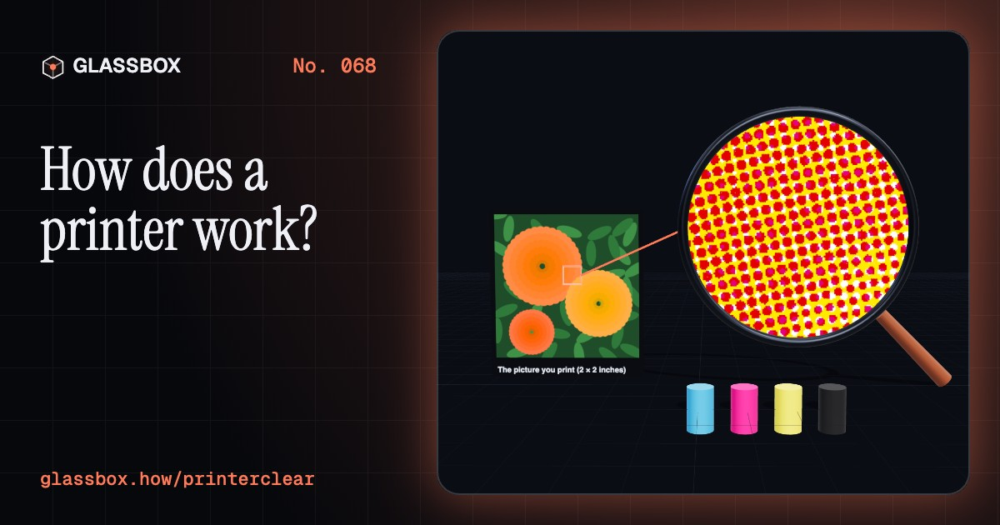
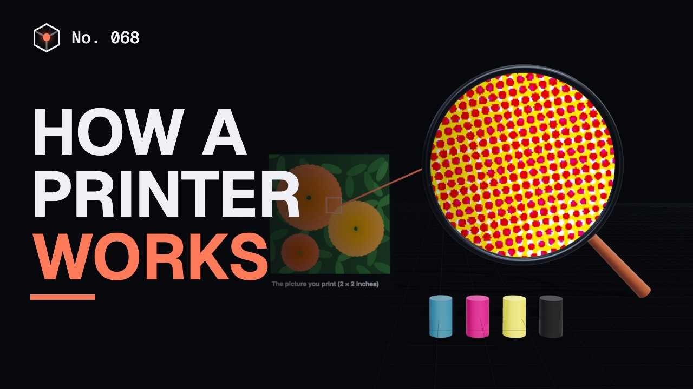
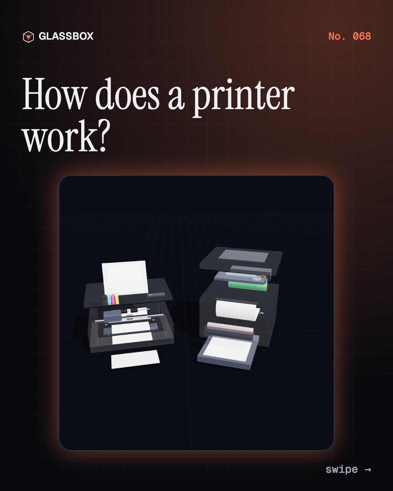
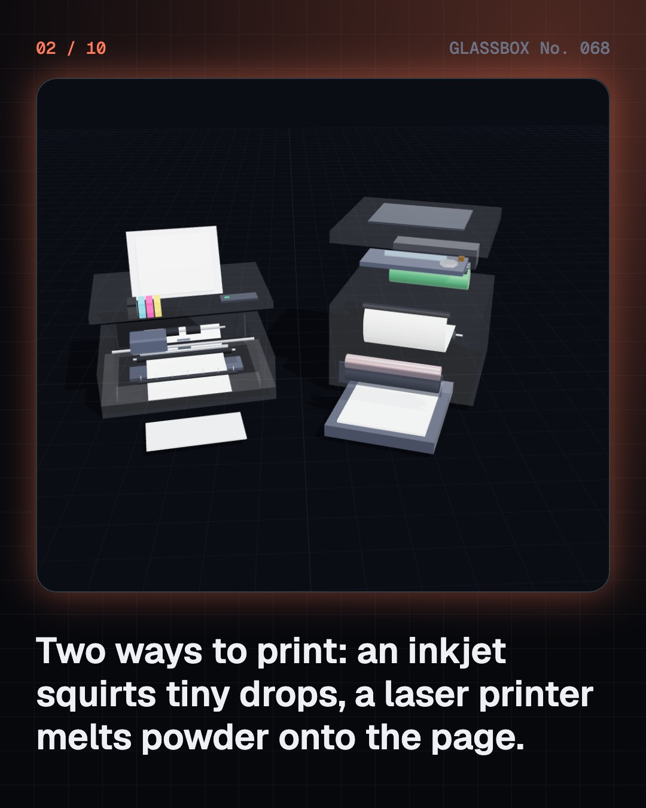
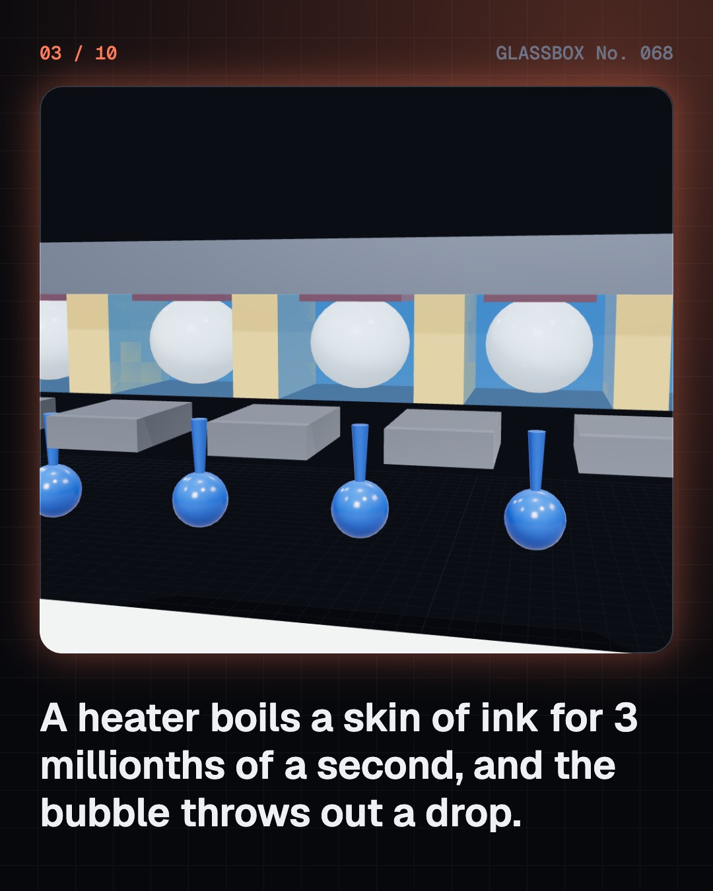
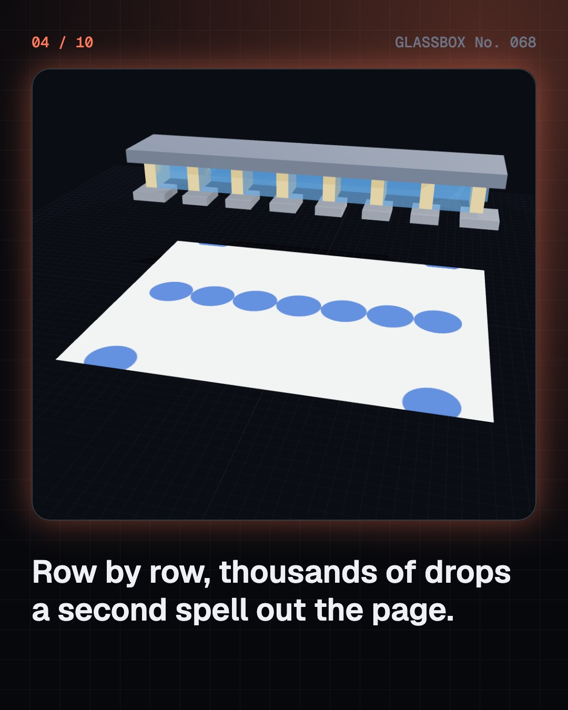

<!-- glassbox:start -->
<!-- Generated from glassbox.json by the Glassbox hub (npm run readme -- printerclear). Edit glassbox.json, not this block. -->
<p align="center"><a href="https://glassbox.how/e/printerclear/"></a></p>

<h1 align="center">PrinterClear</h1>

<p align="center"><b>How does a printer work?</b><br>A heater boils ink into a bubble in three millionths of a second. A laser draws your page in static electricity. Open up an inkjet and a laser printer in 3D and watch every dot land.</p>

<p align="center"><a href="https://glassbox.how/printerclear/"><b>▶ Play with it</b></a> &nbsp;·&nbsp; <a href="https://glassbox.how/e/printerclear/">Read the 60-second explainer</a> &nbsp;·&nbsp; <a href="https://glassbox.how/printerclear/glassbox/reel.mp4">Watch the 40-second video</a></p>

<p align="center">
  <a href="https://glassbox.how/e/printerclear/"></a>
  <a href="https://glassbox.how/e/printerclear/"></a>
  <a href="LICENSE"></a>
  <a href="LICENSE-CONTENT.md"></a>
  <a href="#privacy"></a>
</p>

## In 60 seconds

1. **Two machines, one job: dots.** Every printer turns a page into millions of tiny dots. An inkjet pulls paper past a carriage that sweeps a printhead full of nozzles across it. A laser printer draws the page as static charge on a drum, sticks powdered toner to it and melts the toner onto the paper.
2. **A bubble throws each drop.** In a thermal inkjet, a 3 µs pulse heats a skin of ink to about 300 °C. The vapour bubble throws out a drop of a few picolitres at about 10 m/s, then collapses and the chamber refills. A 5 pL drop is about 21 µm across. Piezo heads squeeze the chamber with a bending crystal instead.
3. **Shades from yes-or-no dots.** A printer can only print a dot or leave the paper white, so it makes shades by changing how many dots it prints, in neat rows (halftone) or scattered (dither). Cyan, magenta and yellow inks take light away from white paper, and black ink is added because real C + M + Y makes a muddy brown.
4. **Charge, light, powder, heat.** The laser printer's drum is charged to about −700 V. Where the laser, swept by a spinning mirror, hits it, the charge leaks away. Negatively charged toner lands only on those spots, is pulled onto the paper, and is melted in by a fuser at about 150 to 200 °C.
5. **Pins, heat and plastic.** Dot-matrix printers fire steel pins through an inked ribbon, which is why banks still use them for passbooks and carbon copies. Receipt printers heat a special coating that turns black, with no ink at all. A 3D printer lays melted plastic in layers about 0.2 mm thick.
6. **The ink is the expensive part.** Cartridge ink can cost over ₹1 lakh a litre because printers are often sold cheaply and paid for through ink. Ink tank printers cost more to buy but print a black page for about 10 paise, not about ₹2. Printing now and then keeps nozzles from drying out.

## Words worth knowing

| Term | Meaning |
|---|---|
| **Printhead** | The chip in an inkjet with hundreds of tiny nozzles that fire drops of ink. |
| **Thermal inkjet** | A printhead that boils a tiny amount of ink so the vapour bubble pushes out a drop. |
| **Piezo inkjet** | A printhead that squeezes out drops with a crystal that bends when a voltage is applied. |
| **dpi** | Dots per inch: how many dots a printer can place along one inch. |
| **Halftone** | A pattern of dots that the eye blends into shades of grey or colour. |
| **CMYK** | Cyan, magenta, yellow and key (black): the four inks most printers use, mixing by taking light away. |
| **Photoconductor** | A coating that holds static charge in the dark but lets it leak away where light hits it. |
| **Toner** | A fine powder of plastic and pigment that laser printers place with static and melt onto paper. |
| **Fuser** | A hot roller and a pressure roller that melt toner into the paper. |

## A short history

**1,200 years from carved wooden blocks to ink tanks, laser drums and machines that print in plastic.**

- **868** · The oldest dated printed book (Wang Jie (who paid for it) and unknown block cutters, Dunhuang, China)
- **1440** · Gutenberg's printing press (Johannes Gutenberg, Mainz, Germany)
- **1847** · Babbage designs a printer for his engine (Charles Babbage, London, England)
- **1938** · The first xerographic copy (Chester Carlson and Otto Kornei, Astoria, New York, USA)
- **1970** · The Centronics 101 dot-matrix printer (Centronics, led by Robert Howard, Hudson, New Hampshire, USA)
- **1971** · The laser printer is invented (Gary Starkweather, Xerox, Webster, New York, and Xerox PARC, California, USA)
- **1984** · The first mass-market inkjet: HP ThinkJet (Hewlett-Packard, Corvallis, Oregon, USA)
- **1984** · The HP LaserJet (Hewlett-Packard, with a Canon print engine, USA and Japan)

The full story, with 24 moments, charts, people and 34 sources: [glassbox.how/e/printerclear/history](https://glassbox.how/e/printerclear/history/). The data lives in [`history.json`](history.json).

## Video and slides

Made with the Glassbox studio from this box's storyboard (`window.glassbox.director`). Free to reuse under CC BY 4.0.

<a href="https://glassbox.how/printerclear/glassbox/video.mp4"></a>

<p><a href="glassbox/slide-1.jpg"></a> <a href="glassbox/slide-2.jpg"></a> <a href="glassbox/slide-3.jpg"></a> <a href="glassbox/slide-4.jpg"></a></p>

| File | What | Size |
|---|---|---|
| [`glassbox/reel.mp4`](https://glassbox.how/printerclear/glassbox/reel.mp4) | Reel / Short, with captions and soundtrack | 1080×1920 |
| [`glassbox/video.mp4`](https://glassbox.how/printerclear/glassbox/video.mp4) | YouTube video, with captions and soundtrack | 1920×1080 |
| `glassbox/slide-1…10.jpg` | Instagram carousel | 1080×1350 |
| `glassbox/thumb.jpg` | YouTube thumbnail | 1280×720 |
| `glassbox/cover.jpg` | Share card and repo social preview | 1200×630 |
| [`glassbox/history-reel.mp4`](https://glassbox.how/printerclear/glassbox/history-reel.mp4) | “History in 10 moments” Reel / Short | 1080×1920 |
| `glassbox/history-slide-*.jpg` | History carousel | 1080×1350 |
| `glassbox/post.json` | Post copy and schedule used by the publish kit | |

## Privacy

This box has no accounts and no ads, and it ships its own fonts and libraries. When you run it yourself it sends nothing anywhere. On glassbox.how, the site's `/bar.js` also loads Glassbox's analytics: **Google Analytics** to count visits (it asks first in the EU, UK and Switzerland, and stays off when your browser sends Global Privacy Control or Do Not Track) and **ClickTrust** to detect bots.

It remembers a few things **in your own browser only**, and never sends them anywhere:

| Browser storage key | What it holds |
|---|---|
| `printerclear.v1` | Which chapters you have opened, your best quiz scores, and sound on or off. |

Exactly what each one sees is at [glassbox.how/privacy](https://glassbox.how/privacy/).

## Licences

- **Code:** [MIT](LICENSE). Use it, change it, ship it.
- **Explanations, text, images and videos** (`glassbox.json`, `glassbox/`): [CC BY 4.0](LICENSE-CONTENT.md). Credit “Glassbox, glassbox.how/e/printerclear”.
- **Third-party parts** keep their own licences: [three.js](https://threejs.org) (MIT), [Geist, Instrument Serif](https://openfontlicense.org) (SIL OFL 1.1).
- The Glassbox name and logo aren't covered by either licence. See the [terms](https://glassbox.how/terms/).

Found a mistake? [Open an issue](https://github.com/bdeeps/printerclear/issues). Corrections happen in public.
<!-- glassbox:end -->

## Run it

It's plain HTML, CSS and JavaScript. No build step and no dependencies. Run locally, it contacts no other website.

```bash
python3 -m http.server 8000
```

Three.js and the fonts ship in `vendor/` and `fonts/`, so it also works offline.

Then open http://localhost:8000.

## How it's built

| File | What |
|---|---|
| `index.html`, `css/app.css` | The page and its styles |
| `js/app.js`, `js/stage.js`, `js/ui.js`, `js/kit.js` | The shared Glassbox 3D engine: chapters, 3D stage, controls, quiz, video director |
| `js/chapters/*.js` | One file per chapter: the 3D model, controls, text, key terms, quiz and video scenes |
| `js/printer.js` | PrinterClear's shared models and numbers: inkjet and laser printer models, drop and scan physics, cost data, the 5×7 dot font and the halftone pictures |
| `glassbox.json` | Title, question, explainer beats, key terms, browser storage and credits shown on glassbox.how |
| `reel` in each chapter | The storyboard the Glassbox studio records into short videos |
| `glassbox/` | The published video, slides, thumbnail and post copy |
| `fonts/`, `vendor/three/` | Self-hosted Geist and Instrument Serif (SIL OFL 1.1) and three.js (MIT) |
